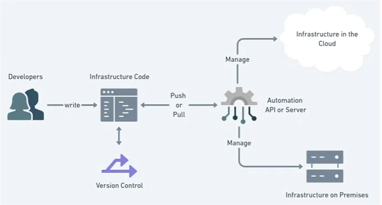

# Infra as Code (IAC)

- Declaração de todos os recursos via código
- Facilita a manutenibilidade de toda a infraestrutura
- Automatiza todo o fluxo de criação, edição e remoção de um recurso

## GitOps

- Incorpora fluxo SCM (Github: pull request, branchs, commit e etc) no contexto operacional
- Evita o famoso "Só vou alterar no console"
- Proporciona uma fonte única de verdade
- Controle de versão em todo fluxo

## Overview



### Modelo declarativo
###### No que precisa ser feito, o como deixamos para ferramenta

- Define o estado desejado (Ex: criar um EC2)
- Engloba todos os recursos do fluxo
- Mantém estados passados no histórico
- Facilita possíveis deleções futuras

### Modelo Imperativo
###### Foca como fazer

- Define os comandos para criar o recurso
- Necessário execução em ordem
- Em alguns casos é possível manter o histórico do que foi feito

# Terraform

- Planificar a criação e edição de recursos
```
terraform plan
```
```
terraform apply
```
- Aplicar a criação ou edição de recursos

- Planificar a destruição de um recurso já criado
```
terraform plan --detroy
```
- Aplicar a destruição de um recurso já criado
```
terraform apply --detroy
```

- Ver qual é o atual workspace
```
terraform workspace show
```

- Criar novo workspace
```
terraform workspace new staging
```